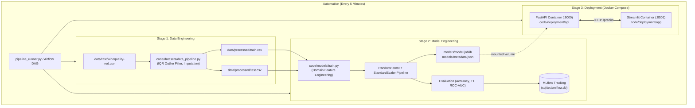

# PMLDL Assignment 1: Automated MLOps Deployment Pipeline

An end-to-end automated MLOps pipeline covering Data Engineering, Model Engineering, and Microservice Deployment in isolated Docker containers, running on an automated 5-minute schedule.

Used dataset: **Wine Quality Dataset**

## Architecture Overview



---

## Repository Structure


```text
├── code/
│   ├── datasets/
│   │   └── data_pipeline.py       # Stage 1: Data loading, cleaning, outlier removal, train/test split
│   ├── models/
│   │   ├── features.py            # Feature engineering logic (chemical ratios, interactions)
│   │   └── train.py               # Stage 2: Model training, MLflow tracking, packaging
│   └── deployment/
│       ├── api/
│       │   ├── main.py            # Stage 3: FastAPI inference & healthcheck service
│       │   ├── features.py        # Shared feature transformations
│       │   ├── requirements.txt   # API container dependencies
│       │   └── Dockerfile         # Dockerfile for FastAPI container
│       ├── app/
│       │   ├── app.py             # Stage 3: Streamlit interactive frontend
│       │   ├── requirements.txt   # Streamlit container dependencies
│       │   └── Dockerfile         # Dockerfile for Streamlit container
│       └── docker-compose.yml     # Multi-container orchestration (network, volumes, ports)
├── data/
│   ├── raw/
│   │   └── winequality-red.csv    # Raw dataset (UCI Wine Quality)
│   └── processed/
│       ├── train.csv              # Cleaned training dataset
│       └── test.csv               # Cleaned testing dataset
├── models/
│   ├── model.joblib               # Packaged trained model artifact
│   ├── metadata.json              # Model parameters, run ID, and evaluation metrics
│   └── confusion_matrix.png       # Test evaluation plot artifact
├── notebooks/                     # Exploratory notebooks
├── services/
│   └── airflow/
│       ├── dags/
│       │   └── mlops_pipeline_dag.py  # Airflow DAG scheduled every 5 minutes
│       └── logs/                  # Airflow task logs
├── pipeline_runner.py             # Standalone cross-platform 5-minute automated scheduler
├── requirements.txt               # Complete Python dependencies
└── README.md                      # Project documentation
```

---

## Quick Start

### 1. Clone & Setup
```bash
git clone https://github.com/Long1Tail/PMLDL_assignment.git
cd PMLDL_assignment

# (Optional) Create and activate virtual environment
python -m venv venv
# Windows:
venv\Scripts\activate
# Linux/macOS:
source venv/bin/activate

# Install dependencies
pip install -r requirements.txt
```

---

## Running the Automated Pipeline

The pipeline is designed to run automatically **every 5 minutes**, executing all three stages sequentially:
1. Data Engineering
2. Model Engineering & MLflow Logging
3. Deployment via Docker Compose

### Option A: Standalone Python Scheduler (Recommended for Testing & Demos)
Run the automated scheduler:
```bash
python pipeline_runner.py --interval 5
```
To run a single cycle immediately and exit:
```bash
python pipeline_runner.py --once
```

### Option B: Apache Airflow DAG
If running inside an Apache Airflow environment:
- The DAG is located at: `services/airflow/dags/mlops_pipeline_dag.py`
- Trigger or unpause `wine_quality_mlops_pipeline` in the Airflow Web UI.
- It is scheduled with `schedule_interval="*/5 * * * *"` (every 5 minutes).

---

№№ Manual Stage Execution

You can also run any stage individually:

### Stage 1: Data Engineering
Loads raw wine quality data, handles missing values, removes extreme outliers with IQR filtering (2.5x IQR), creates binary target `is_good_quality`, and splits 80/20 into train/test:
```bash
python code/datasets/data_pipeline.py
```
*Outputs: `data/processed/train.csv`, `data/processed/test.csv`*

### Stage 2: Model Engineering & MLflow Tracking
Calculates domain-engineered chemical features (free-to-total SO2 ratio, total acidity, acid-to-sugar balance), trains a `RandomForestClassifier` inside a Scikit-Learn `Pipeline` with `StandardScaler`, tracks the run in MLflow, and exports the model:
```bash
python code/models/train.py
```
*Outputs: `models/model.joblib`, `models/metadata.json`, `models/confusion_matrix.png`, MLflow run logged in `sqlite:///mlflow.db`*

To view the MLflow UI:
```bash
mlflow ui --backend-store-uri sqlite:///mlflow.db
# Open http://localhost:5000 in your browser
```

### Stage 3: Deployment via Docker Compose
Builds and starts both the FastAPI backend and the Streamlit frontend in separate isolated containers:
```bash
docker compose -f code/deployment/docker-compose.yml up -d --build
```
To stop the services:
```bash
docker compose -f code/deployment/docker-compose.yml down
```

---

## Accessing the Deployed Services

Once the deployment stage runs:

| Service | URL | Description |
|---|---|---|
| **Streamlit Web Application** | [http://localhost:8501](http://localhost:8501) | Interactive UI with sliders, presets, and prediction visualizer |
| **FastAPI Swagger Docs** | [http://localhost:8000/docs](http://localhost:8000/docs) | Interactive OpenAPI documentation and API testing |
| **FastAPI Healthcheck** | [http://localhost:8000/health](http://localhost:8000/health) | Live status, model readiness, and run ID |
| **FastAPI Metadata** | [http://localhost:8000/metadata](http://localhost:8000/metadata) | Active model parameters and test metrics |

---

## Testing the API via cURL / REST

You can query the model API directly:

```bash
curl -X POST "http://localhost:8000/predict" \
     -H "Content-Type: application/json" \
     -d '{
       "fixed_acidity": 8.5,
       "volatile_acidity": 0.28,
       "citric_acid": 0.45,
       "residual_sugar": 2.3,
       "chlorides": 0.055,
       "free_sulfur_dioxide": 18.0,
       "total_sulfur_dioxide": 45.0,
       "density": 0.9942,
       "ph": 3.32,
       "sulphates": 0.82,
       "alcohol": 12.8
     }'
```

**Example Response:**
```json
{
  "prediction": 1,
  "prediction_label": "Good Quality (Score >= 6)",
  "probability_good": 0.8425,
  "probability_standard": 0.1575,
  "status": "success",
  "model_loaded_at": "2026-09-17T07:25:13.831733Z"
}
```

---

## Evaluation Metrics

Current test set performance tracked in MLflow:
- **Accuracy:** ~77.1%
- **F1 Score (Macro):** ~0.778
- **ROC-AUC:** ~0.847
- **Precision:** ~82.4%
- **Recall:** ~73.7%

---


